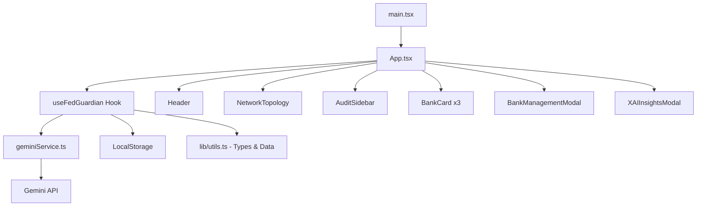
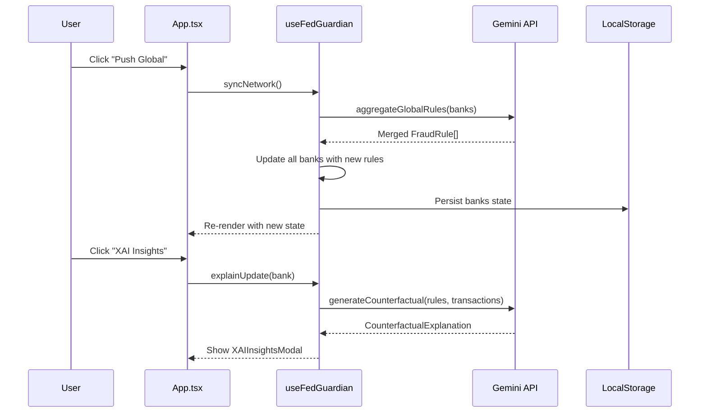

# 🛡️ FedGuardian AI

**Decentralized Fraud Prevention Network** — A federated learning simulator where multiple bank nodes collaboratively train fraud detection rules, powered by Gemini AI for intelligent rule aggregation and Explainable AI (XAI) diagnostics.

---

## 🧰 Tech Stack

| Layer | Technology |
|-------|-----------|
| **Framework** | React 19 + TypeScript |
| **Build Tool** | Vite 5 |
| **Styling** | Tailwind CSS v4 (`@tailwindcss/vite` plugin) |
| **Animations** | Motion (Framer Motion) |
| **Icons** | Lucide React |
| **AI Backend** | Google Gemini API (`@google/genai`) |
| **State** | React Hooks + LocalStorage persistence |

---

## 📁 Project Structure

```
Fed-Guardian/
├── index.html                  # HTML entry point
├── vite.config.ts              # Vite + React + Tailwind v4 plugins
├── package.json                # Dependencies & scripts
├── .env                        # VITE_GEMINI_API_KEY
│
└── src/
    ├── main.tsx                # React DOM mount point
    ├── index.css               # Tailwind imports + font config
    ├── App.tsx                 # Root orchestrator (wires everything)
    │
    ├── hooks/
    │   └── useFedGuardian.ts   # All state management & business logic
    │
    ├── components/
    │   ├── Header.tsx              # Top navigation bar
    │   ├── NetworkTopology.tsx     # Hub + node visualization
    │   ├── AuditSidebar.tsx        # Event log sidebar
    │   ├── BankCard.tsx            # Bank summary card
    │   ├── BankManagementModal.tsx  # Rule editor + transaction log
    │   └── XAIInsightsModal.tsx    # XAI diagnostic overlay
    │
    ├── lib/
    │   └── utils.ts            # Types, interfaces, mock data, cn()
    │
    └── services/
        └── geminiService.ts    # Gemini API calls (aggregation + XAI)
```

---

## 🏗️ Architecture Diagram



---

## 🔄 Data Flow



---

## 📄 File-by-File Breakdown

### `src/App.tsx` — Root Orchestrator
Minimal ~90-line file that wires all components together. Consumes the `useFedGuardian` hook and passes state/callbacks down as props. Contains the inline CSS for grid background and scrollbar hiding.

### `src/hooks/useFedGuardian.ts` — Brain of the App
All state and business logic lives here:
- **State**: `banks`, `globalRules`, `logs`, `selectedBank`, `explanation`, modal visibility
- **`syncNetwork()`**: Calls Gemini to aggregate rules across banks, updates all nodes
- **`handleUpdateRule()`**: Local rule editing (threshold, weight, name, active toggle)
- **`saveAndSync()`**: Propagates one bank's rules to all others (manual override)
- **`explainUpdate()`**: Calls Gemini for counterfactual XAI analysis
- **Persistence**: Banks auto-save to `localStorage` on every change

### `src/components/Header.tsx` — Top Navigation
Sticky top bar showing:
- FedGuardian AI logo + title
- Network status indicator (animated pulse)
- **"Push Global"** button → triggers `syncNetwork()`

### `src/components/NetworkTopology.tsx` — Hub Visualization
Interactive SVG-based network map:
- Central **FedGuardian Core** hub with pulsing animation during sync
- Bank nodes positioned radially with dashed connection lines
- **Animated particles** travel along lines during aggregation
- Bottom stats bar: Avg Accuracy, Fraud Rate, Observations, Sync State
- Click any node → opens `BankManagementModal`

### `src/components/AuditSidebar.tsx` — Event Log
Scrollable log panel showing timestamped events:
- Network sync events (`aggregation`)
- Manual rule updates (`local_update`)
- System errors (`system`)

### `src/components/BankCard.tsx` — Bank Summary Card
Grid card for each bank showing:
- Bank name, ID, accuracy score
- Top 2 fraud rules with thresholds
- **"XAI Insights"** button → opens `XAIInsightsModal`
- **"Local Rules"** button → opens `BankManagementModal`

### `src/components/BankManagementModal.tsx` — Rule Editor
Full-screen modal with two panels:
- **Left**: Editable fraud rules (name, description, threshold slider, weight slider, active/disabled toggle) + "Save & Distribute" button
- **Right**: Transaction evidence log (merchant, amount, location, fraud/clean status) + "Analyze Counterfactuals" button

### `src/components/XAIInsightsModal.tsx` — XAI Diagnostic
Scrollable two-panel overlay:
- **Left**: Decision Path Synthesis, Counterfactual Outcome, Delta Implementation steps
- **Right**: Impact metrics (accuracy projection, risk mitigation), Grounding Engine info
- Loading skeletons while Gemini processes

### `src/lib/utils.ts` — Types & Data
Core type definitions and utilities:
- **`FraudRule`**: id, name, description, threshold, weight, category, isActive
- **`Transaction`**: id, amount, location, timestamp, isFraud, type, merchant
- **`Bank`**: id, name, rules[], transactions[], performanceScore, fraudRate, color
- **`AuditLog`**: id, timestamp, event, details, type
- **`CounterfactualExplanation`**: originalDecision, counterfactualScenario, requiredChanges[], impactDescription
- **`INITIAL_BANKS`**: 3 pre-configured banks with mock transactions
- **`cn()`**: Tailwind class merger utility (clsx + tailwind-merge)

### `src/services/geminiService.ts` — Gemini AI Integration
Two API functions using `gemini-3-flash-preview` with structured JSON output:
- **`aggregateGlobalRules(banks)`**: Merges local rules into a global set, respecting user-modified thresholds. Falls back to best-performing bank's rules on error.
- **`generateCounterfactual(rules, newRules, bankName, transactions)`**: Generates DiCE-style counterfactual explanations comparing old vs new rules against actual transaction data.

---

## 🚀 Getting Started

```bash
# Install dependencies
npm install

# Set your Gemini API key
echo "VITE_GEMINI_API_KEY=your_key_here" > .env

# Start dev server
npm run dev
```

---

## 🔑 Environment Variables

| Variable | Description |
|----------|-------------|
| `VITE_GEMINI_API_KEY` | Google Gemini API key for AI features |

---

## ✨ Key Features

1. **Federated Learning Simulation** — 3 bank nodes with independent fraud rules collaboratively train a global model
2. **AI-Powered Aggregation** — Gemini merges local rules while preserving manual threshold edits
3. **Explainable AI (XAI)** — Counterfactual diagnostics explain *why* rule changes improve detection
4. **Real-time Visualization** — Animated network topology with data flow particles
5. **Manual Override** — Edit any rule and distribute changes across the network
6. **Persistent State** — Bank configurations survive page reloads via LocalStorage
7. **Audit Trail** — Every action logged with timestamps for compliance
